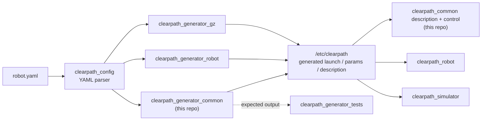

# clearpath_common

ROS 2 common packages for Clearpath Robotics platforms.

This repository provides the core platform bringup, control, diagnostics, robot description assets, and generator utilities used across Clearpath robotic platforms.

For supported platforms, sensors and manipulators plus additional details, please see:
<https://docs.clearpathrobotics.com/docs/ros/>

## Where this fits in the Clearpath ROS 2 stack

`clearpath_common` holds the platform-agnostic building blocks shared by both real robots
(`clearpath_robot`) and simulation (`clearpath_simulator`): the URDF descriptions, controllers,
diagnostics, and — importantly — the **common generator** that turns a parsed `robot.yaml` into
launch/description output.



`clearpath_generator_common` is the shared generator base: `clearpath_generator_robot` and
`clearpath_generator_gz` build on it. Its generators and templates live under
[`clearpath_generator_common/clearpath_generator_common`](clearpath_generator_common/clearpath_generator_common)
and produce bash environment setup, robot description (URDF/xacro), the discovery server config,
and the manipulator SRDF.

## Packages

- `clearpath_common`: Metapackage for core common stack.
- `clearpath_bt_joy`: Bluetooth joystick watchdog. Monitors HID report-rate on `/dev/hidrawN` and publishes a stop flag when link quality drops below threshold. Only for PS5 at the moment.
- `clearpath_control`: Platform controllers, localization, and teleoperation launch files.
- `clearpath_customization`: Templates and generators for project bringup/description customization.
- `clearpath_description`: Clearpath URDF descriptions metapackage.
- `clearpath_diagnostics`: Diagnostic updater and aggregator launch/config.
- `clearpath_generator_common`: Common Python generator utilities and templates.
- `clearpath_manipulators`: Manipulator integration package.
- `clearpath_manipulators_description`: Manipulator description assets.
- `clearpath_mounts_description`: Mount description assets.
- `clearpath_platform_description`: Common platform meshes, URDF, and description launch.
- `clearpath_sensors_description`: Sensor description assets.

## Requirements

- Ubuntu with ROS 2 installed.
- `colcon` and standard ROS 2 build tools.
- A robot setup directory at `/etc/clearpath` (or a custom `setup_path`) for runtime configuration files. For more details, see [docs.clearpathrobotics.com](https://docs.clearpathrobotics.com/).

## Build

From your ROS 2 workspace root:

```bash
rosdep install --from-paths src --ignore-src -r -y
colcon build --symlink-install
source install/setup.bash
```

## Generator Tests

Changes to the generators in this repository (`clearpath_generator_common`) may affect the
generated output for launch files, parameter files, and descriptions. The
[clearpath_generator_tests](https://github.com/clearpathrobotics/clearpath_generator_tests)
repository versions the expected output and validates it through CI.

Before merging, ensure a corresponding branch with the **same name** exists in
`clearpath_generator_tests` with regenerated samples. See the
[Development Workflow](https://github.com/clearpathrobotics/clearpath_generator_tests#development-workflow)
section of `clearpath_generator_tests` for the full process.

## Documentation

- [Generators](https://docs.clearpathrobotics.com/docs/ros/config/generators) — how `clearpath_generator_common` turns `robot.yaml` into bash/description/launch/param files.
- [Robot YAML overview](https://docs.clearpathrobotics.com/docs/ros/config/yaml/overview) — the input configuration format.
- [Clearpath ROS 2 documentation](https://docs.clearpathrobotics.com/docs/ros/) — full platform documentation.

## License

BSD. See [LICENSE](LICENSE).
